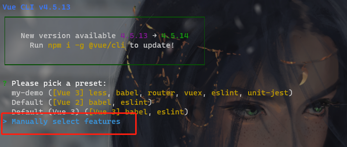
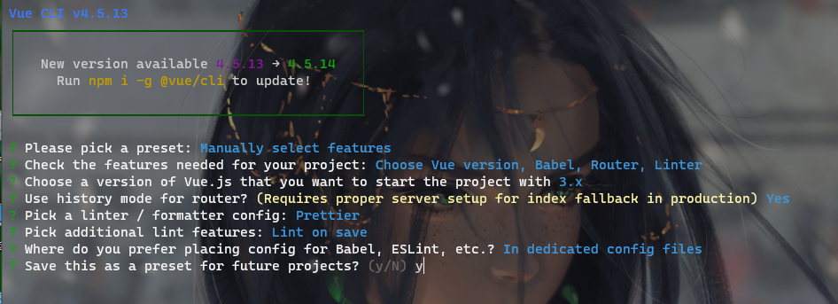
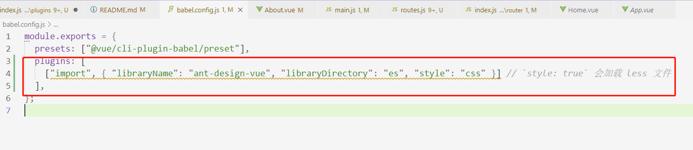

# vue-app

## Project setup
```
npm install
```

### Compiles and hot-reloads for development
```
npm run serve
```

### Compiles and minifies for production
```
npm run build
```

### Lints and fixes files
```
npm run lint
```

### Customize configuration
See [Configuration Reference](https://cli.vuejs.org/config/).


## 1.创建项目
```
vue create 项目名称

```

控制台会提示你选择安装类型，选择manually select features选项



在后续的features中，通过space键选中Router即可。其他的随着自己需求选择。最后通过回车确认。

在后面的选项中按照以下选择即可。




## 2.基础配置

### 2.1引入配置

在src目录下新建``plugins/index.js``文件，并且添加以下内容

```javascript
import router from "@/router";

//按照需求引入antd
import { Button } from "ant-design-vue";


/**
 * 插件集合
 * @type {import("vue").Plugins[]}
 */
const plugins = [router, Button];


/**
 * 批量注册插件
 * @param {import("vue").App} app
 */
export const usePlugins = app =>
    plugins.forEach(app.use, app)


```

打开``src/main.js``文件，将其中代码调整为如下

```javascript
import { createApp } from "vue";
import App from "./App.vue";
import { usePlugins } from '@/plugins';


const app = createApp(App);

usePlugins(app);
app.mount("#app");

// createApp(App).use(router).mount("#app");

```


### 2.2 优化route

打开``src/router/index.js``，删除以下内容

```javascript
import Home from "../views/Home.vue";

const routes = [
  {
    path: "/",
    name: "Home",
    component: Home,
  },
  {
    path: "/about",
    name: "About",
    // route level code-splitting
    // this generates a separate chunk (about.[hash].js) for this route
    // which is lazy-loaded when the route is visited.
    component: () =>
      import(/* webpackChunkName: "about" */ "../views/About.vue"),
  },
];
```

同时在同级目录下新建routes.js，并且在其中添加以下内容

```javascript

/**
 * 路由表
 * @type {import("vue-router").RouteRecordRaw[]}
 */
export const routes = [
    {
        path: "/",
        name: "Home",
        component: () => import("@/views/Home.vue"),
    },
    {
        path: "/about",
        name: "About",
        // route level code-splitting
        // this generates a separate chunk (about.[hash].js) for this route
        // which is lazy-loaded when the route is visited.
        component: () =>
            import(/* webpackChunkName: "about" */ "../views/About.vue"),
    },

];
```


## 3.配置antd

安装antd和babel

```
npm install ant-design-vue@next --save

npm i babel-plugin-import
```

打开``babel.config.js``文件，在其中添加以下内容

```javascript
plugins: [
    ["import", { "libraryName": "ant-design-vue", "libraryDirectory": "es", "style": "css" }] // `style: true` 会加载 less 文件
  ],
```

效果如下



这里配置的是按需加载antd，后续需要加载组件样式的时候，直接在``plugins/index.js``文件中加入``import { Button } from "ant-design-vue";``类似代码,并且将对象加入plugins数组中去。例如

```javascript
const plugins = [router, Button];
```

后续即可正常使用。


## 4.完成

至此，使用vue cli3 + antd（按需加载）配置成功。参考教程<[vue3+antd+koa实战博客，vue实战教程，vuecli4_哔哩哔哩_bilibili](https://www.bilibili.com/video/BV1Qy4y117gU?p=4)>


## 5. 配置axios

```shell

npm install axios


```


## 5.常规命令

```sh
//启动项目
npm run serve

//编译项目
npm run build
```

